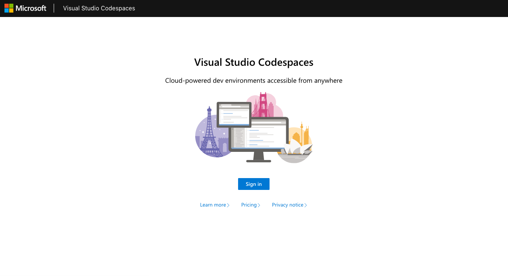
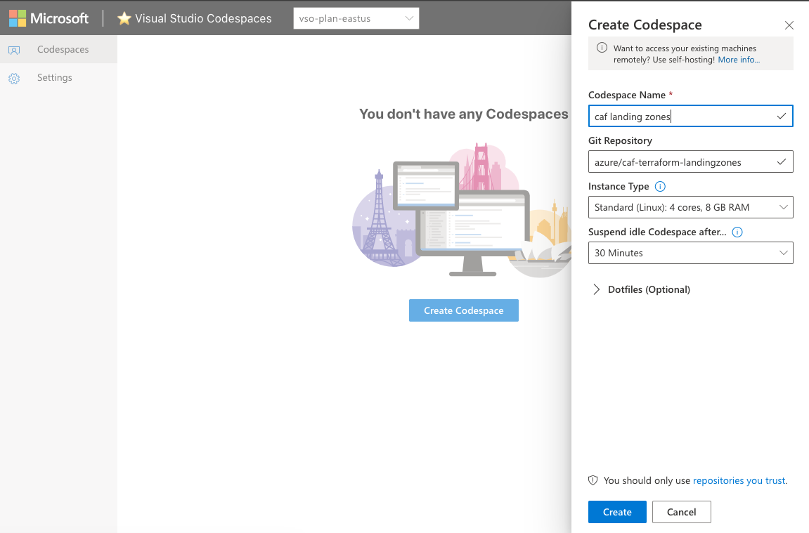
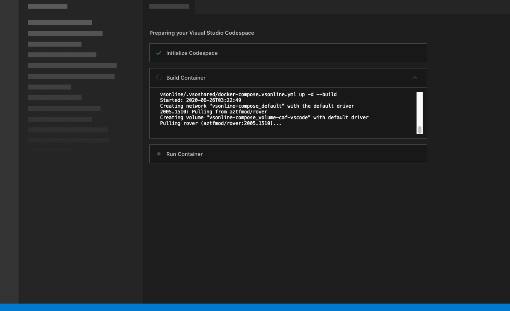
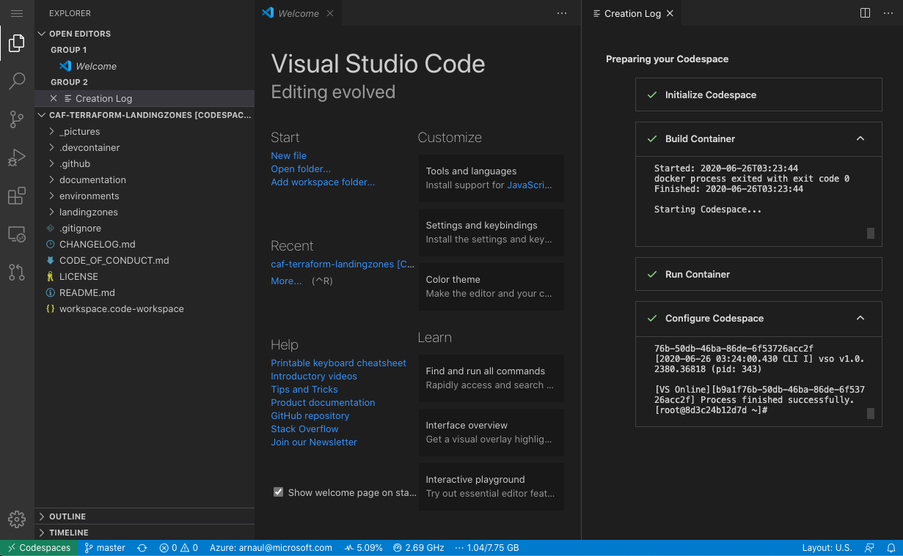
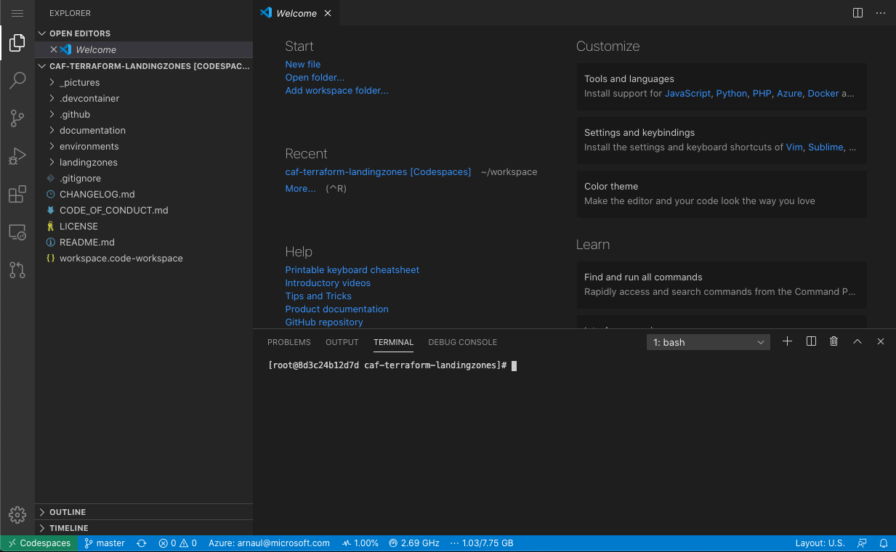
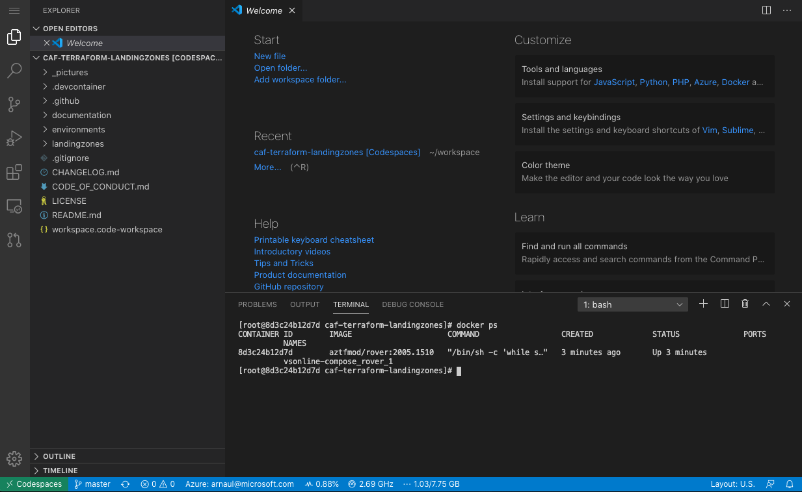
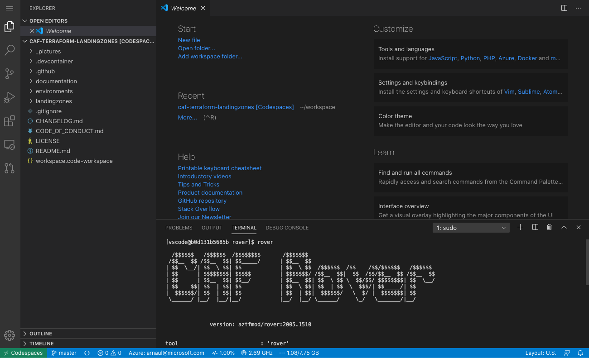

# Getting stated with Azure Cloud Adoption Framework landing zones on Visual Studio Codespaces

## Introduction

Visual Studio Codespaces is a browser-based editor with support for Git repos, extensions, and a built-in command line interface so you can edit, run, and debug your applications from any device. For more details on Visual Studio Codespace, you can visit the product page [here](https://visualstudio.microsoft.com/services/visual-studio-codespaces/)

## Prerequisites

In order to start deploying your with CAF landing zones on VS Codespaces, you need:

* an Azure subscription (Trial, MSDN, etc.)

## Create your account

Let's authenticate first:
[https://aka.ms/vso-login](https://aka.ms/vso-login)


## Create the repository in Visual Studio Code

Create the landing zones Codespaces clicking here: [](https://online.visualstudio.com/environments/new?name=caf%20landing%20zones&repo=azure/caf-terraform-landingzones)



The create process will look something like that:



Once ready, you should have your Visual Studio Interface as follow:


Open a Terminal using ```CTRL``` + ```J``` or ```Command``` + ```J```



Get the rover name shipped with the release you are using by typing:

```bash
docker ps
```



Get inside the rover using the command based on the output of the image name:

```bash
sudo docker run -it aztfmod/rover:2005.1510
```

Once completed, you are ready to use landing zones by launching the rover as below:

```bash
rover
```




## Deploying your first landing zone

You must be authenticated first:
For that we will rely on Azure authentication as completed by Azure Cli, via browser method:

```bash
rover login
```

We recommend that you verify the output of the login and make sure the subscription selected by default is the one you want to work on. If not, you can use the following switch:

```bash
az account set --subscription <subscription_GUID>
```

On the first run, you need to use the launchpad to create the foundations for Terraform environment, the launchpad_opensource is the current way to set those foundations.

Running the following command:

```bash
launchpad /tf/launchpads/launchpad_opensource_light apply
```

This command will interactively prompt you for *var.location*, asking for the name of a supported Azure region **where you want to deploy the Terraform state and dependencies**. You can specify that in the argument as in the following example:  

```bash
launchpad /tf/launchpads/launchpad_opensource_light apply -var 'location=westus'
```

You can then launch your first landing zone!

Please note that each landing zone come with its own deployment settings, which may deploy resources in different region than where you set the foundations.  

You are ready to start:

```bash
rover /tf/caf/landingzones/landingzone_caf_foundations plan
```

```bash
rover /tf/caf/landingzones/landingzone_caf_foundations apply
```

```bash
rover /tf/caf/landingzones/landingzone_caf_foundations destroy
```

Happy deployment with Azure landing zones, let us know your feedback and how you need it to evolve!